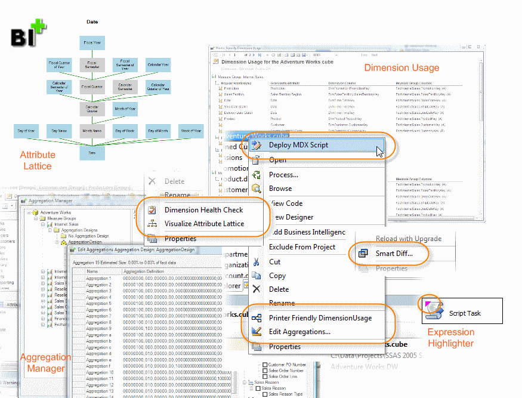

A Visual Studio add-in that enhances development functionality in Business Intelligence Development Studio (BIDS) and SQL Server Data Tools (SSDTBI).

_This project was previously called BIDS Helper (see [Project History](projecthistory))_

## Installation

Starting with *{{site.title}}* for SQL 2016 which is installed in Visual Studio 2015, install it from the [Visual Studio Gallery](/features/InstallingfromtheVisualStudioGallery).

To install *{{site.title}}* in earlier versions of Visual Studio, download the installer from the [downloads](/downloads) page. For silent installs you can run the setup .exe file with a /S command line option.

If for some reason you cannot use the installer the latest release includes an [xcopy deploy](/features/xcopydeploy) option.

## Documentation
All of the features in *{{site.title}}* are documented under the [Features](/features) menu.




#### {{comp.title}} Features
 - [{{ feature.title }}]({{feature.url}})



## News



 
  <ul>
  
  
    <li>
      <a href="{{ ann.url }}">
        {{ ann.date | date_to_string }} - {{ ann.title }}
      </a>
    </li>
  
  
  </ul>

  

    <a class="btn btn-default" href="/news">See all past news</a>
  

